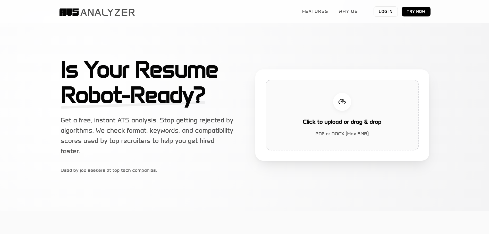

# ATS Analyzer

A professional, high-performance web application designed to help job seekers optimize their resumes for Applicant Tracking Systems (ATS).



## 🚀 Overview

ATS Analyzer provides instant, AI-powered feedback on resumes. It simulates real-world ATS algorithms to check for formatting errors, keyword density, and overall compatibility, ensuring candidates don't get filtered out by bots before a human sees their application.

## ✨ Features

- **Drag & Drop Upload Zone**: Intuitive interface for easy file submission.
- **Smart Analysis Engine**: Simulates ATS scoring logic to provide a compatibility percentage.
- **Detailed Feedback**: Breaks down analysis into actionable insights (e.g., File Format, Industry Keywords, Contact Info placement).
- **Professional Aesthetic**: Strict black-and-white, high-contrast design using **Goldman** and **Anta** fonts for a futuristic, authoritative look.
- **Responsive Design**: Fully optimized for desktop, tablet, and mobile devices.
- **Component-Based Architecture**: Built with reusable React components (Buttons, Cards, Inputs).

## 🛠️ Tech Stack

- **Frontend**: React.js (v18)
- **Build Tool**: Vite
- **Styling**: Vanilla CSS (Variables, Flexbox/Grid, Animations)
- **Typography**: Google Fonts (Goldman, Anta)
- **Icons**: SVG / Lucide React (Planned)

## 📦 Installation & Setup

1.  **Clone the repository:**
    ```bash
    git clone https://github.com/dini28/ATS.git
    cd ATS
    ```

2.  **Install dependencies:**
    ```bash
    npm install
    ```

3.  **Run the development server:**
    ```bash
    npm run dev
    ```

4.  **Open in browser:**
    Navigate to `http://localhost:5173` (or the port shown in your terminal).

## 📂 Project Structure

```
src/
├── components/
│   ├── ui/           # Reusable UI components (Button.jsx, etc.)
│   ├── Hero.jsx      # Main landing & upload section
│   ├── Features.jsx  # Feature highlights
│   ├── AnalysisResult.jsx # Result dashboard & scoring logic
│   ├── Login.jsx     # Authentication view
│   └── Header.jsx    # Navigation & branding
├── App.jsx           # Main application layout & routing logic
├── App.css           # Global styles & variables
└── main.jsx          # Entry point
```

## 🎨 Design System

The application adheres to a strict design language:
- **Primary Font**: `Goldman` (Headings, Branding)
- **Secondary Font**: `Anta` (Body text, UI elements)
- **Colors**: Monochrome palette (Black, White, Grays) with subtle status indicators (Green/Yellow).

## 📄 License

This project is licensed under the MIT License.
